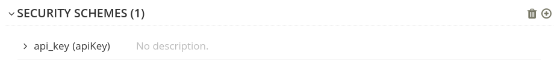

## Using APICurio to edit an OpenAPI spec and visualise Kuadrant extensions

This guide assumes you have APICurio already running.
See https://www.apicur.io/ for info on how to install APICurio Studio.

### Editing the spec

Open or import your OpenAPI spec in the APICurio UI.
You can modify the source of the spec from the UI.
There are a few different configuration and extension points supported by APICurio, and also supported by the `kuadrantctl` cli.

To generate a HTTPRoute for the API, add the following `x-kuadrant` block to your spec, replacing values to match your APIs details and the location of your Gateway.

```yaml
info:
    x-kuadrant:
        route:
            name: petstore
            namespace: petstore
            hostnames:
                - 'petstore.example.com'
            parentRefs:
                -   name: prod-web
                    namespace: kuadrant-multi-cluster-gateways
                    kind: Gateway

When added, the UI will show this in the Vendor Extensions section:


See [this guide](./generate-gateway-api-httproute.md) for more info on generating a HTTPRoute.

Add a `securityScheme` to the components block so that an AuthPolicy can be generated.
This `securityScheme` requires that an API key header is set.

```yaml
    securitySchemes:
        api_key:
            type: apiKey
            name: api_key
            in: header
```

When added, the UI will display this in the security requirements section:



See [this guide](./generate-kuadrant-auth-policy.md) for more info on generating an AuthPolicy.

To generate a RateLimitPolicy for the API, add the following `x-kuadrant` block to a path in your spec,
replacing values to match your APIs details.

```yaml
paths:
    /:
        x-kuadrant:
            backendRefs:
                -
                    name: petstore
                    namespace: petstore
                    port: 8080
            rate_limit:
                rates:
                    -
                        limit: 2
                        duration: 10
                        unit: second
```

When added, the UI will show this in Vendor Extensions section for that specific path:


See [this guide](./generate-kuadrant-rate-limit-policy.md) for more info on generating a RateLimitPoliicy.
There is also the full [kuadrantctl guide](./openapi-kuadrant-extensions.md).
